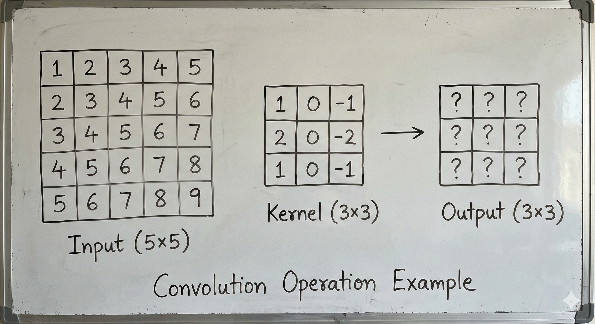
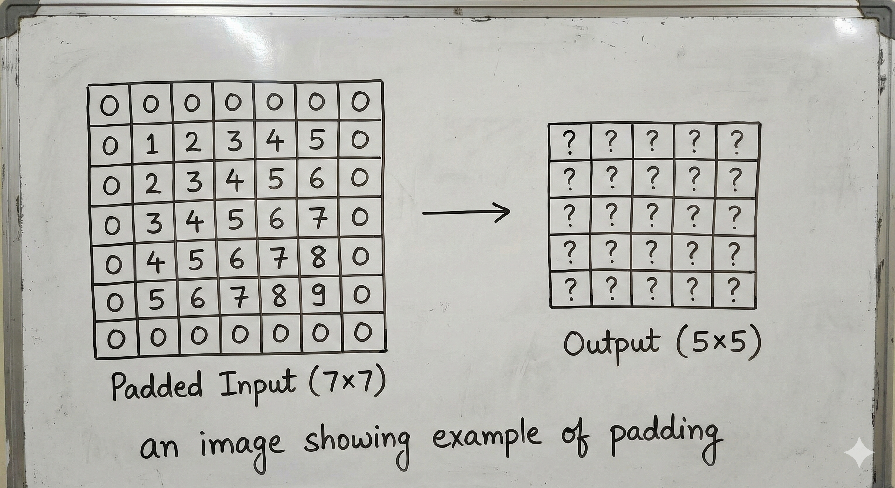

Convolutional Neural Networks (CNNs) have revolutionized computer vision, but their power comes from a simple mathematical operation: **convolution**. In this post, we'll build a solid understanding of the foundations that make CNNs work, from the mathematical definition to the key properties that make them so effective for image processing.

## What is Discrete Convolution?

At its core, convolution is a mathematical operation that combines two functions to produce a third. In the context of deep learning, we work with **discrete convolution** since we're dealing with digital images (discrete pixel values).

### 1D Convolution

Let's start simple. For a 1D input signal $x$ and a kernel (filter) $w$, the discrete convolution is defined as:

$$(x * w)[i] = \sum_{k} x[i-k] \cdot w[k]$$

Think of it as sliding the kernel across the input and computing a weighted sum at each position.

**Example:** If we have input `[1, 2, 3, 4, 5]` and kernel `[1, 0, -1]`:

```
Position 0: 1×(-1) + 2×0 + 3×1 = 2
Position 1: 2×(-1) + 3×0 + 4×1 = 2
Position 2: 3×(-1) + 4×0 + 5×1 = 2
```

This particular kernel computes the difference between adjacent elements—a simple edge detector!

### 2D Convolution

For images, we extend this to two dimensions:

$$(X * W)[i,j] = \sum_{m} \sum_{n} X[i-m, j-n] \cdot W[m, n]$$

The kernel slides across both height and width dimensions:



## Cross-Correlation vs Convolution: Why CNNs "Cheat"

Here's a detail that trips up many learners: **CNNs don't actually use convolution—they use cross-correlation!**

The difference is subtle but important:

- **Convolution:** Flips the kernel before sliding
- **Cross-correlation:** Uses the kernel as-is

$$(X \star W)[i,j] = \sum_{m} \sum_{n} X[i+m, j+n] \cdot W[m, n]$$

Notice the `+` signs instead of `-` signs. In true convolution, the kernel is flipped both horizontally and vertically before the operation.

**Why do we call it "convolution" in CNNs then?**

Because the kernels are *learned*, not hand-designed. If the network needs a flipped version of some pattern detector, it will simply learn the flipped weights directly. The mathematical distinction doesn't affect what the network can learn—only what weights it learns to achieve the same result.

For clarity: when you use `torch.nn.Conv2d`, you're actually performing cross-correlation. This is a universal convention in deep learning.

## Padding: Controlling Output Dimensions

When you slide a 3×3 kernel across a 5×5 image, the output shrinks to 3×3. This happens because the kernel can't be centered on edge pixels without going out of bounds. **Padding** solves this.

### Types of Padding

**Valid Padding (No Padding)**
- No padding added
- Output is smaller than input
- Output size: $(n - k + 1)$ where $n$ is input size and $k$ is kernel size

**Same Padding**
- Pad so output has same spatial dimensions as input
- For a 3×3 kernel: add 1 pixel of padding on each side
- Padding amount: $\lfloor k/2 \rfloor$ on each side

**Full Padding**
- Pad so every input pixel is visited by every kernel position
- Output is larger than input
- Padding amount: $k - 1$ on each side



## Stride: Controlling the Step Size

**Stride** determines how many pixels the kernel moves at each step. A stride of 1 means the kernel moves one pixel at a time; a stride of 2 means it skips every other position.

**Output size formula:**

$$\text{output size} = \lfloor \frac{n + 2p - k}{s} \rfloor + 1$$

Where:
- $n$ = input size
- $p$ = padding
- $k$ = kernel size
- $s$ = stride

**Example calculations:**
- Input: 32×32, Kernel: 3×3, Padding: 1, Stride: 1 → Output: 32×32
- Input: 32×32, Kernel: 3×3, Padding: 1, Stride: 2 → Output: 16×16
- Input: 224×224, Kernel: 7×7, Padding: 3, Stride: 2 → Output: 112×112

Stride > 1 is commonly used to downsample feature maps without using pooling layers.

## Receptive Field: What Each Neuron "Sees"

The **receptive field** of a neuron is the region of the original input that influences its activation. Understanding receptive fields is crucial for designing effective CNN architectures.

### Single Layer Receptive Field

For a single convolutional layer with kernel size $k$, each output neuron has a receptive field of $k \times k$ pixels.

### Multi-Layer Receptive Field

As you stack convolutional layers, receptive fields grow. For $L$ layers with kernel size $k$ and stride 1:

$$\text{RF} = 1 + L \times (k - 1)$$

**Example:** Three 3×3 conv layers:
- After layer 1: RF = 3×3
- After layer 2: RF = 5×5
- After layer 3: RF = 7×7

This is why **stacking small kernels is preferred over using large kernels**—three 3×3 layers achieve the same receptive field as one 7×7 layer, but with:
- Fewer parameters: $3 \times (3^2) = 27$ vs $7^2 = 49$
- More non-linearities (one ReLU per layer)
- More expressive power

### With Stride

When stride $s > 1$, the receptive field grows faster:

$$\text{RF}_l = \text{RF}_{l-1} + (k_l - 1) \times \prod_{i=1}^{l-1} s_i$$

This is why early layers in CNNs often use stride-2 convolutions—they rapidly expand the receptive field while reducing spatial dimensions.

## Parameter Sharing: The CNN's Secret Weapon

Unlike fully connected layers, convolutional layers use **parameter sharing**: the same kernel weights are applied at every spatial location.

### Why This Matters

Consider processing a 224×224 RGB image:

**Fully Connected Layer:**
- Input neurons: 224 × 224 × 3 = 150,528
- If output has 1000 neurons: 150,528 × 1000 = **150 million parameters**

**Convolutional Layer (3×3 kernel, 64 output channels):**
- Parameters: 3 × 3 × 3 × 64 = **1,728 parameters**

That's a reduction of almost 100,000×! This dramatic reduction comes from two key assumptions:

1. **Local connectivity:** Each output neuron only connects to a small region of the input
2. **Parameter sharing:** The same pattern detector is applied everywhere

These assumptions encode our prior knowledge that useful patterns in images (edges, textures, objects) can appear anywhere in the image and should be detected regardless of position.

## Translation Equivariance: Detecting Patterns Anywhere

Parameter sharing gives CNNs a powerful property: **translation equivariance**.

**What does this mean?**

If you shift the input, the output shifts by the same amount. If a cat detector fires at position (10, 20) for a given image, and you shift the entire image 5 pixels to the right, the detector will fire at position (15, 20).

Mathematically:

$$f(T_x(I)) = T_x(f(I))$$

Where $T_x$ is a translation operator and $f$ is the convolution operation.

**Why is this useful?**

- A feature detector trained to find vertical edges will find them *anywhere* in the image
- The network doesn't need to learn separate detectors for "vertical edge at top-left" vs "vertical edge at bottom-right"
- This is a powerful **inductive bias** that makes CNNs data-efficient for vision tasks

**Note:** Translation equivariance is broken by:
- Stride > 1 (aliasing effects)
- Padding (edge effects)
- Pooling with stride > 1

Modern architectures sometimes use techniques like anti-aliased downsampling to better preserve equivariance.

## The Forward Pass: Putting It All Together

Let's derive the complete forward pass for a convolutional layer with:
- Input: $X$ of shape $(N, C_{in}, H, W)$ — batch size, input channels, height, width
- Kernel: $W$ of shape $(C_{out}, C_{in}, k_H, k_W)$
- Bias: $b$ of shape $(C_{out},)$

The output $Y$ has shape $(N, C_{out}, H_{out}, W_{out})$:

$$Y[n, c_{out}, i, j] = b[c_{out}] + \sum_{c_{in}=0}^{C_{in}-1} \sum_{m=0}^{k_H-1} \sum_{n=0}^{k_W-1} W[c_{out}, c_{in}, m, n] \cdot X[n, c_{in}, i \cdot s + m, j \cdot s + n]$$

Each output channel is the sum of convolutions across all input channels, plus a bias term.

## Backward Pass: Computing Gradients

For training, we need gradients with respect to both the weights and the input.

### Gradient with Respect to Weights

$$\frac{\partial L}{\partial W[c_{out}, c_{in}, m, n]} = \sum_{i,j} \frac{\partial L}{\partial Y[c_{out}, i, j]} \cdot X[c_{in}, i \cdot s + m, j \cdot s + n]$$

This is also a convolution! The gradient w.r.t. weights is computed by convolving the input with the upstream gradient.

### Gradient with Respect to Input

$$\frac{\partial L}{\partial X[c_{in}, i, j]} = \sum_{c_{out}} \sum_{m,n} \frac{\partial L}{\partial Y[c_{out}, \lfloor\frac{i-m}{s}\rfloor, \lfloor\frac{j-n}{s}\rfloor]} \cdot W[c_{out}, c_{in}, m, n]$$

This is a **transposed convolution** (also called deconvolution or fractionally-strided convolution). The gradient flows backward through the conv layer by convolving the upstream gradient with the *flipped* kernel.

## Hands-On: Implementing 2D Convolution from Scratch

Here's a NumPy implementation to solidify your understanding:

```python
import numpy as np

def conv2d_forward(X, W, b, stride=1, padding=0):
    """
    Forward pass for 2D convolution.

    Args:
        X: Input of shape (N, C_in, H, W)
        W: Weights of shape (C_out, C_in, kH, kW)
        b: Bias of shape (C_out,)
        stride: Stride for the convolution
        padding: Zero-padding added to both sides

    Returns:
        Output of shape (N, C_out, H_out, W_out)
    """
    N, C_in, H, W_in = X.shape
    C_out, _, kH, kW = W.shape

    # Calculate output dimensions
    H_out = (H + 2 * padding - kH) // stride + 1
    W_out = (W_in + 2 * padding - kW) // stride + 1

    # Apply padding
    if padding > 0:
        X_padded = np.pad(X, ((0, 0), (0, 0), (padding, padding), (padding, padding)))
    else:
        X_padded = X

    # Initialize output
    Y = np.zeros((N, C_out, H_out, W_out))

    # Perform convolution
    for n in range(N):  # For each sample in batch
        for c_out in range(C_out):  # For each output channel
            for i in range(H_out):  # For each output row
                for j in range(W_out):  # For each output column
                    # Extract the receptive field
                    h_start = i * stride
                    w_start = j * stride
                    receptive_field = X_padded[n, :, h_start:h_start+kH, w_start:w_start+kW]

                    # Compute weighted sum across all input channels
                    Y[n, c_out, i, j] = np.sum(receptive_field * W[c_out]) + b[c_out]

    return Y


def conv2d_backward(dY, X, W, stride=1, padding=0):
    """
    Backward pass for 2D convolution.

    Args:
        dY: Upstream gradient of shape (N, C_out, H_out, W_out)
        X: Input from forward pass of shape (N, C_in, H, W)
        W: Weights of shape (C_out, C_in, kH, kW)
        stride: Stride used in forward pass
        padding: Padding used in forward pass

    Returns:
        dX: Gradient w.r.t. input
        dW: Gradient w.r.t. weights
        db: Gradient w.r.t. bias
    """
    N, C_in, H, W_in = X.shape
    C_out, _, kH, kW = W.shape
    _, _, H_out, W_out = dY.shape

    # Apply padding to input
    if padding > 0:
        X_padded = np.pad(X, ((0, 0), (0, 0), (padding, padding), (padding, padding)))
    else:
        X_padded = X

    # Initialize gradients
    dX_padded = np.zeros_like(X_padded)
    dW = np.zeros_like(W)
    db = np.zeros_like(W.shape[0])

    # Compute gradients
    for n in range(N):
        for c_out in range(C_out):
            for i in range(H_out):
                for j in range(W_out):
                    h_start = i * stride
                    w_start = j * stride

                    # Gradient w.r.t. weights
                    dW[c_out] += dY[n, c_out, i, j] * X_padded[n, :, h_start:h_start+kH, w_start:w_start+kW]

                    # Gradient w.r.t. input
                    dX_padded[n, :, h_start:h_start+kH, w_start:w_start+kW] += dY[n, c_out, i, j] * W[c_out]

    # Gradient w.r.t. bias (sum over batch, height, width)
    db = np.sum(dY, axis=(0, 2, 3))

    # Remove padding from dX
    if padding > 0:
        dX = dX_padded[:, :, padding:-padding, padding:-padding]
    else:
        dX = dX_padded

    return dX, dW, db


# Test against PyTorch
if __name__ == "__main__":
    import torch
    import torch.nn as nn

    # Create test data
    np.random.seed(42)
    X_np = np.random.randn(2, 3, 8, 8).astype(np.float32)
    W_np = np.random.randn(16, 3, 3, 3).astype(np.float32)
    b_np = np.random.randn(16).astype(np.float32)

    # NumPy forward
    Y_np = conv2d_forward(X_np, W_np, b_np, stride=1, padding=1)

    # PyTorch forward
    conv = nn.Conv2d(3, 16, 3, stride=1, padding=1, bias=True)
    conv.weight.data = torch.from_numpy(W_np)
    conv.bias.data = torch.from_numpy(b_np)
    X_torch = torch.from_numpy(X_np)
    Y_torch = conv(X_torch)

    # Compare
    print(f"Max difference: {np.max(np.abs(Y_np - Y_torch.detach().numpy())):.6f}")
    print("Forward pass matches!" if np.allclose(Y_np, Y_torch.detach().numpy(), atol=1e-5) else "Mismatch!")
```

## Key Takeaways

1. **Convolution (cross-correlation) is the core operation** that slides a kernel across an input to detect local patterns

2. **Padding and stride control output dimensions** and how thoroughly the input is processed

3. **Receptive fields grow with network depth**, allowing deeper layers to capture larger patterns

4. **Parameter sharing drastically reduces parameters** by using the same weights at every spatial location

5. **Translation equivariance** means patterns are detected regardless of position—a powerful inductive bias for vision

6. **The backward pass is also a convolution**, making gradients efficient to compute

Understanding these foundations is essential before diving into advanced architectures like ResNet or exploring applications like object detection. The mathematical framework you've learned here forms the basis for everything that follows in the CNN world.

## What's Next?

In the next post, we'll explore **CNN Architecture Components**—pooling operations, batch normalization, and the design patterns that make modern networks work. We'll see how these building blocks combine to create powerful feature extractors.

---

*This post is part of my Deep Learning Fundamentals series. Check out the [CNN Learning Modules](/hf47f378tfgfwyegu83g/cnn_modules.html) for a complete learning path.*
